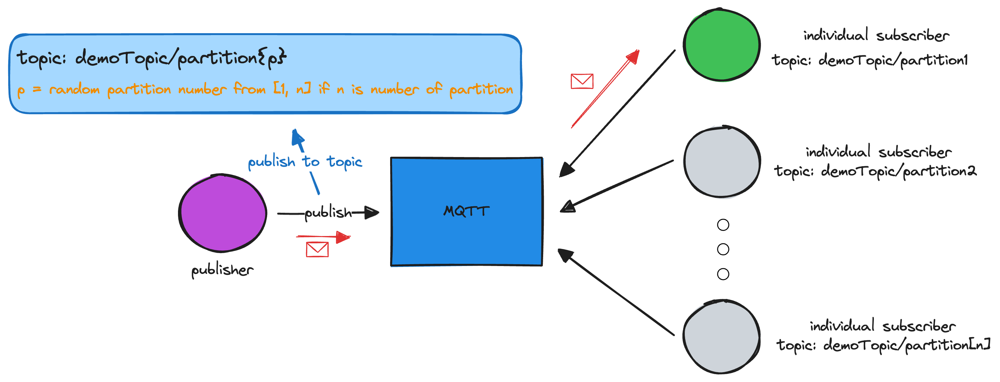
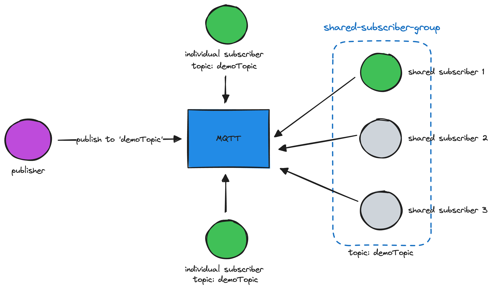

This repository contains source code for demonstrating 2 approaches to load balance messages from a single topic to multiple consumers in MQTT.

# MQTT Client Load Balancing Approaches
## Approach 1: Multiple Partitions using Topic Hierarchy (Custom Implementation for MQTT v3.1.1)
branch: **multiple-partitions-topic-hierarchy**

This approach leverages the topic hierarchy to create multiple partitions for shared subscriptions. By organizing the topic hierarchy, multiple partitions are established, and each consumer can subscribe to a specific partition independently.

For example:

- The publisher randomly publishes messages to 'demoTopic/partition1', 'demoTopic/partition2', or 'demoTopic/partition3' (using a uniform distribution).
- Consumer1 subscribes to 'demoTopic/partition1'.
- Consumer2 subscribes to 'demoTopic/partition2'.
- Consumer3 subscribes to 'demoTopic/partition3'.

This method resembles the partitioning of topics in Kafka. However, it is not a standard way of partitioning topics in MQTT and requires custom implementation by both publishers and consumers. Consequently, you must manually set up the topic hierarchy for each partition on all devices that publish messages to the topic. Additionally, you need to deploy multiple consumers to subscribe to each partition, with the number of consumers matching the number of partitions.

For this, if we need to scale out consumers, we need to reassign the partitions to each device that publishes messages to the topic, and then deploy new consumers to subscribe to the new partitions.

## Approach 2: Shared Subscriptions with new Feature in MQTT (MQTT v5)
branch: **shared-subscriptions-mqtt-v5**

From HiveMQ.com:
> In a standard MQTT subscription, each subscribing client is privy to a copy of each message broadcasted to that topic. With shared subscriptions, clients sharing a subscription in the same group receive messages in rotation, a process sometimes referred to as client load balancing. The message load of a single topic is distributed across all subscribers.

Structure of the shared subscription topic:
```
$share/<group>/topic
```

The first part is the shared subscription identifier, which is `$share`. The second part is the group identifier, which is the name of the group. The third part is the actual topic that the shared subscription is subscribing to.

For example:


- Publisher publishes messages to the topic 'demoTopic'.
- Consumer1 subscribes to the shared subscription '$share/shared-subscriber-group/demoTopic'.
- Consumer2 subscribes to the shared subscription '$share/shared-subscriber-group/demoTopic'.
- Consumer3 subscribes to the shared subscription '$share/shared-subscriber-group/demoTopic'.

For this approach, you don't need to manually set up the topic hierarchy for each partition on all devices that publish messages to the topic. You can use the shared subscription feature in MQTT v5 to distribute messages across multiple consumers. However, you need to ensure that all consumers are using MQTT v5 to support shared subscriptions.

Additionally, if you have to scale out consumers, you can assign them to the same group, and the MQTT broker will automatically distribute messages to all consumers in the group. You don't need to manually manage the number of partitions and consumers, avoiding the needs to update the topic on all devices that publish messages to the topic.

# Running the Demo
## Prerequisites
- Docker

## Steps
1. Clone the repository:
```bash
git clone [repository-url]
```

2. Switch to the branch for the desired approach:
```bash
git checkout [branch-name]
```

3. Run the demo:
```bash
docker-compose up
```

4. Analyze the logs to see how messages are distributed to each consumer.

### References:
- [StackOverflow thread: Is it possible to distribute reads of an MQTT topic over multiple consumers?](https://stackoverflow.com/questions/27850819/is-it-possible-to-distribute-reads-of-an-mqtt-topic-over-multiple-consumers)
- [HiveMQ Blog: Shared Subscriptions in MQTT v5](https://www.hivemq.com/blog/mqtt5-essentials-part7-shared-subscriptions/)
